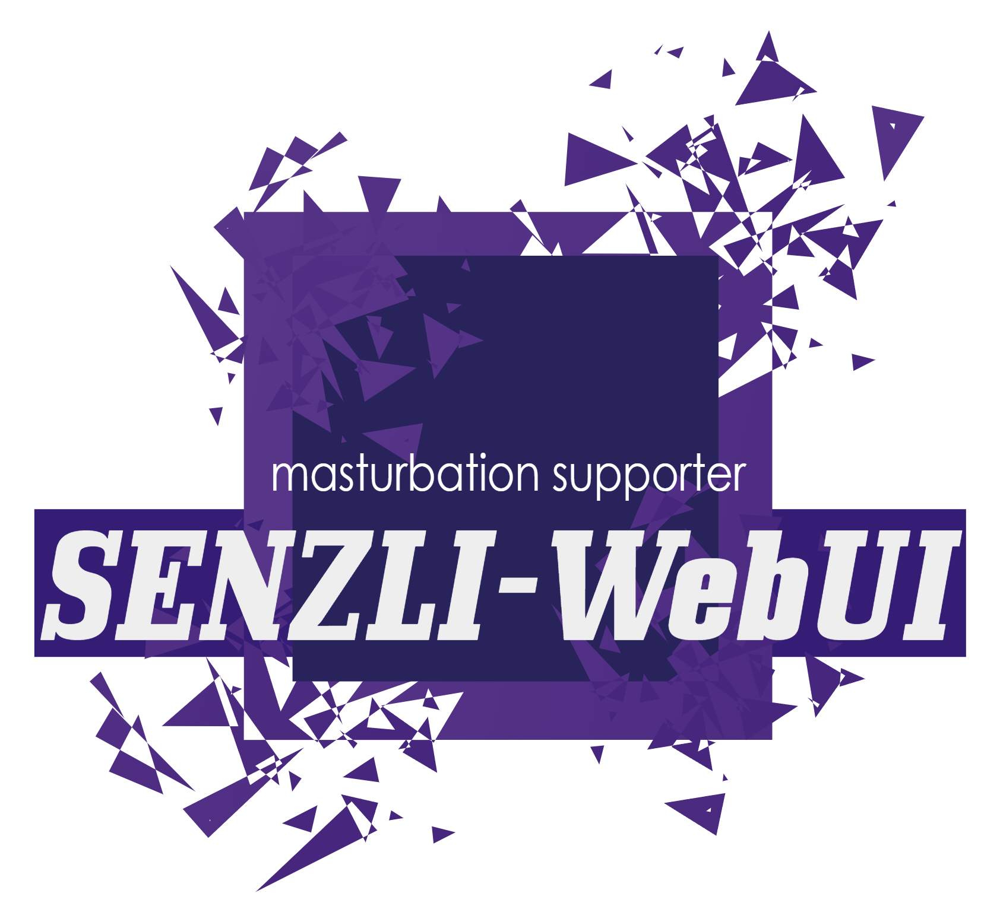

# SENZLI-WebUI
<p>
SENZLI-WebUIは、Node.jsとExpress、dotenv環境で動作するシンプルなメディアプレイヤーです。
主な機能は、mp4形式のビデオファイルとpng、jpeg、jpg、webp、gif形式の画像ファイルの再生と切り替えです

機能:
- メディアプレイヤーは、`http://127.0.0.1:3000`にアクセスすることで利用できます。
- 画像のみまたはビデオのみの表示を選択できます。
- 任意の時間で画像を自動的に切り替えることができます、切り替えにはボタン、矢印キー、任意のキーが使用できます。
- ビデオが最後まで再生されたら次のビデオに切り替えます、ループ再生も選択できます。
- スマートフォンでも使用できます。

Node.jsとExpressとdotenvのインストール方法:
1. Node.jsのインストール:
   - Node.jsの公式ウェブサイト (https://nodejs.org/) から、OSに合ったインストーラーをダウンロードします。
   - ダウンロードしたインストーラーを実行し、指示に従ってNode.jsをインストールします。
   - インストールが完了したら、ターミナル（コマンドプロンプト）で `node -v` を実行して、Node.jsのバージョンが表示されることを確認します。
2. Expressのインストール:
   - ExpressはNode.jsのWebアプリケーションフレームワークです。プロジェクトフォルダーで以下のコマンドを実行してExpressをインストールします。
  ```
   npm install express
  ```
3. dotenvのインストール方法:
   - dotenvは、.envファイルから環境変数をprocess.envに読み込むためのモジュールです。
   - dotenvをインストールするには、次のコマンドを実行します。
  ```
   npm install dotenv
  ```
プログラムの概要:
- このプログラムは、Expressを使用してWebサーバーを立ち上げます。
- `http://127.0.0.1:3000`にアクセスすると、メディアプレイヤーが表示されます。
- プレイヤー上では、任意の時間で画像やビデオを自動的に切り替えることが可能です、切り替えにはボタン、矢印キーが使用できます。また、任意のキーを設定できます。
- .envファイルのEXCLUSIONに指定した名前のフォルダーや、「#」を付与したファイルまたはフォルダーは取得対象外となり、プレイヤーに表示されません。

このプログラムは、ローカルサーバー上で動作するシンプルなメディアプレイヤーであり、画像切り替えのスピードを調整することができます。ビデオ再生終了時には、次のビデオを自動的に再生します。

</p>
<h1>メディアプレイヤーのフォルダー構成と配置手順</h1>
<p>
このメディアプレイヤーを正しく動作させるには、フォルダーの作成が必須です。
メインフォルダー直下に「video」と「image」フォルダーを作成し、
「video」フォルダーの中には対応しているビデオファイル（.mp4など）を配置します。
「image」フォルダーの中には対応している画像ファイル（.png、.jpeg、.jpg、.webp、.gif）を配置します。
また、必要に応じて「image」と「video」フォルダー内にさらにフォルダーを作成して、ジャンル分けを行うこともできます。
例えば、「video/映画」フォルダーや「image/スケベ」フォルダーを作成して、ビデオと画像をジャンル別に整理することができます。
このように整理することで、メディアプレイヤーの管理がより便利になります。
</p>
<h1>同じWi-Fiに接続しているデバイスでメディアプレイヤーを使用する方法</h1>
<p>
config.json ファイルの Access.local を false に設定します。
コマンドプロンプトで ipconfig と入力し、表示される IPv4 アドレスをコピーします。
.env ファイル内の WiFi_IPAddress にコピーした IPv4 アドレスを貼り付けます。
サーバーを起動します。

ウェブブラウザで`http://{IPv4Address}:3000`にアクセスすることで、メディアプレイヤーを利用できます。
</p>
<h1>外部フォルダーのメディア取得手順</h1>
<p>
外部フォルダーからメディアを取得するためには、以下の手順を実行します。まず、config.jsonファイル内のdirConditionsの値をfalseに変更します。次に、envファイルのFOLDERパスを対象のフォルダーのフルパスに置き換えます。なお、FOLDERパスの設定において、「ドキュメント」および「ダウンロード」フォルダーは使用可能なフォルダーです。一方、これ以外のフォルダーでは、「Not allowed to load local resource」エラーが発生し、ローカルリソースの読み込みが制限されます。
</p>
<h1>操作についての詳細な説明</h1>
<p>
操作に関する詳細な説明を以下に示します。なお、これらの操作は、cssのメディアクエリ適用サイズが601px以上のwindowサイズを前提として進行します。<br>
hiddenボタン:<br>

- hiddenボタンがオンの場合、ejaculation、PIP、Play、speedバー、ejaculationカウンターが非表示になります。
- ボタンの背景色はtransparentに変更されます。<br>

menuボタン:<br>

- dark: 背景色が#000（黒）に設定されます。
- img only: 画像のみを表示するメディアに切り替えます。
- video only: ビデオのみを表示するメディアに切り替えます。
- img onlyがオンの状態で、PIP（ピクチャ・イン・ピクチャ）を使用することが可能です。<br>

中央のボタン:<br>

- back image、next image: 画像の操作を行います。
- back video、next video: 動画の操作を行います。
- 操作ボタンの下に配置されている四角のボックスは、textareaタグを使用した入力ボックスです。矢印キーを使用して画像またはビデオの操作が可能です。
- speedバー:
- 画像の自動変更速度を0.2秒刻みで調整できるスピードバーが中央に配置されています。
- playボタン: ビデオの再生と停止を切り替えることができます。
- PIP: PIPは"ピクチャ・イン・ピクチャ"の略称であり、Pythonのpipとは無関係です。
- ejaculationボタン: 押した時間とカウントを表示します。
</p>

